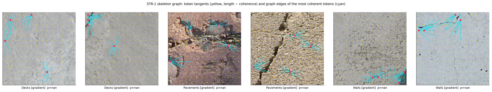
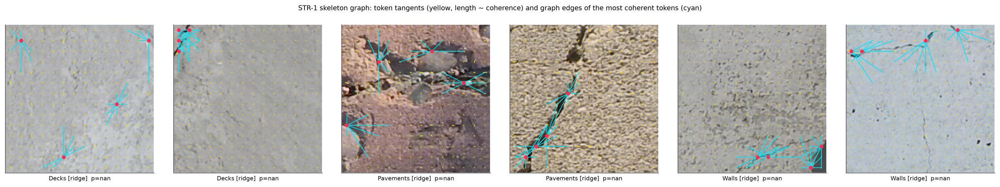

# STR-1 — skeleton-graph sparse attention

Implementation of design-notebook idea **STR-1** (Axis 1, Structure): *a crack is a graph (a skeleton with
branches), so let a token attend only along plausible skeleton edges.* Code: `geometry.py` (primitives,
graph, attention), used by `vit.py` and `hybrid.py`.

## Models

| model | command | params | train img/s @ bs 64 (bench) |
|---|---|---|---|
| ViT-S/16, conv stem, MHSA (reference) | `python train.py --stem conv --lr 0.0003` | 22.39 M | 366 |
| **ViT-S/16, conv stem, STR-1** | `python train.py --stem conv --attention str1` | 22.39 M (+60) | 276 |
| hybrid ResNet-26, attention off (plain ResNet) | `python train.py --variant hyb_r26 --hybrid-attn-stages ""` | 15.08 M | — |
| hybrid ResNet-26, MHSA (BoTNet-style) | `python train.py --variant hyb_r26 --attention mhsa` | 13.13 M | 417 |
| **hybrid ResNet-26, STR-1** | `python train.py --variant hyb_r26 --attention str1` | 13.13 M | 369 |
| **hybrid ResNet-50, STR-1** | `python train.py --variant hyb_r50 --attention str1` | 19.30 M | 254 |

Peak memory at batch 64 is at most 3.5 GB for every row (RTX 3060, bf16). The data loader delivers
~385 img/s, so in practice the STR-1 slowdown is smaller than the bench numbers suggest.

**ViT + STR-1:** every one of the 12 blocks uses STR-1. The graph is built once per image (from the input) and
shared by all blocks. [CLS] attends to every token and every token may attend to [CLS], so global information
still reaches the head. Patch-to-patch attention is sparse.

**Hybrid ("ResNet-style conv attention model")** (`hybrid.py`): ResNet-D stem + bottleneck stages
(64/128/256/512 width, ×4 expansion). In stages 3 (14×14, the same grid as ViT-S/16) and 4 (7×7), the first
(strided) block stays convolutional; every later block replaces its 3×3 conv with self-attention over the feature
map (one head per 64 channels), plus a learned 2-D relative position bias, as in BoTNet (Srinivas et al. 2021).
With `--attention str1` those attention blocks are STR-1. A separate skeleton graph is built for each grid
(14×14 and 7×7). `--hybrid-attn-stages "4"` gives BoTNet placement; `""` gives a plain ResNet (the conv-only
baseline). The final BN of every bottleneck is zero-initialised, which helps training from scratch.

## Mechanism as implemented

**1. Token geometry (no gradients, from the augmented input).** Two priors:

* `ridge` (default): Hessian of the grey image smoothed at σ = 2 px. Per pixel: eigenvalues l_max ≥ l_min and
  normal ψ (direction of l_max). Dark-line strength r = relu(l_max − |l_min|): positive in a dark valley
  (crack), ≈ 0 for dark blobs and pits (both curvatures large) and for bright lines. Token tensor
  T = avgpool_token(r·[cos²ψ, cosψ sinψ, sin²ψ]), so only line pixels vote; ridge energy e_i = avgpool(r).
* `gradient`: the textbook structure tensor avgpool([gx², gx·gy, gy²]) (ablation; see the finding below).

Tangent θ_i = ½·atan2(2T_xy, T_xx − T_yy) + π/2 (mod π). Coherence coh_i = ((λ1−λ2)/(λ1+λ2+ε))², with ε a
noise floor of 5% of the image-mean energy. The gate is c_i = coh_i · e_i / max_j e_j for the ridge prior
(a token must be line-like *and* carry real dark-line evidence), and c_i = coh_i for the gradient prior.

**2. Graph.** For a query i and candidates j with 0 < d_ij ≤ radius (token cells):

```
a_ij = |cos(angle(p_j - p_i) - θ_i)|        displacement along i's tangent        (cone, alpha)
o_ij = |cos(θ_i - θ_j)|                     similar orientation                    (beta)
g_ij = 1[a ≥ cos α]·1[o ≥ cos β]            hard
     = σ((a − cos α)/τ)·σ((o − cos β)/τ)    soft (τ = 0.05)
s_ij = c_i · log(g_ij + 1e-4) − d_ij / ρ
E_i  = {i} ∪ top-k_j s_ij
```

**3. Attention.** Sparse heads mask the logits to E_i (−∞ elsewhere). In `soft` mode they also add
γ_h·s_ij on the edges, with γ_h learned per head (init 1). The first `str_dense_heads` heads are ordinary
dense attention (the "dense fallback head"). Implemented as an additive mask in `scaled_dot_product_attention`.

### Where this deviates from the notebook text, and why

| notebook | here | reason |
|---|---|---|
| "j in the k nearest neighbours and in the cone" | top-k of a score over a radius, cone/orientation as a log-prior | with a hard filter, a coherent token on a short crack can have < k (or 0) valid neighbours; here the remaining slots fall back to the nearest tokens, so no token is ever cut off |
| "soft gating by c_i" | the prior is multiplied by c_i inside the score | an incoherent (texture) token automatically gets an isotropic kNN neighbourhood; a coherent one gets the along-tangent neighbourhood; the change is continuous |
| hard vs soft mask | `hard` = mask only (binary prior); `soft` = soft prior + learned edge bias | both share the same top-k mechanism, so the ablation isolates the soft bias |
| structure tensor from raw gradients (§1) | Hessian ridge prior by default | see the finding below |
| cost O(Nk) | O(N²) mask, dense masked kernel | at N = 197 a dense masked kernel is faster on a GPU than gather-based sparse attention; FLOPs are therefore *not* reduced in this implementation. A true O(Nk) kernel only pays off at much larger N (e.g. patch 8) |

### Finding: the raw-gradient structure tensor follows texture, not cracks

On real SDNET cracks, the textbook structure tensor puts its most coherent tokens on aggregate texture, dark
spots and image corners. Inside a 16×16 patch, a 2–3 px crack contributes a small share of the gradient
energy, and rough texture dominates (notebook principle 2: dark + linear ≠ crack). The ridge prior puts them
on the crack: in the figures below, the diagonal pavement crack (4th panel) and the wall cracks (5th and 6th
panels). Red dots mark the 4 tokens with the highest gate; cyan lines are their graph edges; yellow sticks are
tangents with length ∝ gate.

Gradient prior: `docs/figures/str1_prior_gradient.jpg`


Ridge prior: `docs/figures/str1_prior_ridge.jpg`


Known limits of the ridge prior: wide spalling gaps and joints are dark lines too, so they also light up (the
notebook's joint confounder). Faint hairlines next to a stronger dark crack get a lower gate, because e_i is
normalised per image.

Synthetic check (30° dark line on noise): tangent recovered at 28–30°, gate 0 off the line, and texture tokens
get the isotropic 3×3 neighbourhood.

## Ablations (all are flags)

| question | runs |
|---|---|
| does STR-1 help over dense attention? | `--attention mhsa` vs `--attention str1` (same model otherwise) |
| k | `--str-k 4`, `8`, `16` |
| hard vs soft | `--str-mode hard` vs `soft` |
| dense fallback head | `--str-dense-heads 0` vs `1` (vs `2`) |
| coherence gating | `--str-coh-gate false` |
| prior | `--str-prior gradient` vs `ridge`; `--str-sigma 1.5 / 3` |
| geometry tolerances | `--str-alpha 20 / 45`, `--str-beta 20 / 45`, `--str-radius 3 / 6` |
| hybrid placement | `--hybrid-attn-stages "4"` (BoTNet), `"3,4"`, `""` (plain ResNet) |

Run names encode every non-default STR-1 setting (e.g. `vit_s16_conv_str1-hard-k4-d0-grad_bs64_...`), so
ablation runs never overwrite each other. `python aggregate.py` collects them into one table.

## Explanations (`gradcam.py`)

For STR-1 models, Grad-CAM adds a **STR-1 coherence prior** panel (the gate c_i) and writes
`fig_str1_graph`: token tangents plus the graph edges of the most coherent tokens on one correctly detected
crack per surface. The prior also gets a row in the deletion/insertion faithfulness table, which shows whether
the input-derived geometry alone points at the pixels the model relies on. For the hybrid, Grad-CAM uses the
stage-3 (14×14) and stage-4 (7×7) feature maps.

## Status (2026-10-07)

Implemented and smoke-tested on GPU (2-epoch runs on 512 images per split + Grad-CAM, both models, both
priors). MHSA ViT-S/16 still matches timm exactly. **No full training run yet, so there is no evidence yet
that STR-1 helps.**
